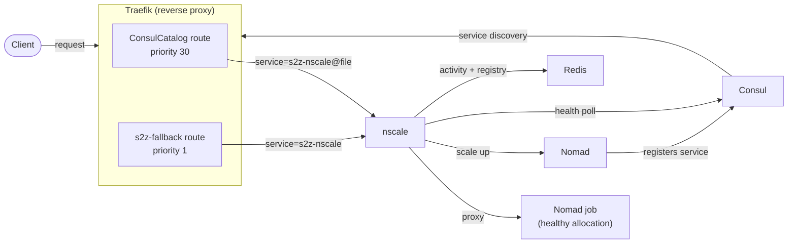
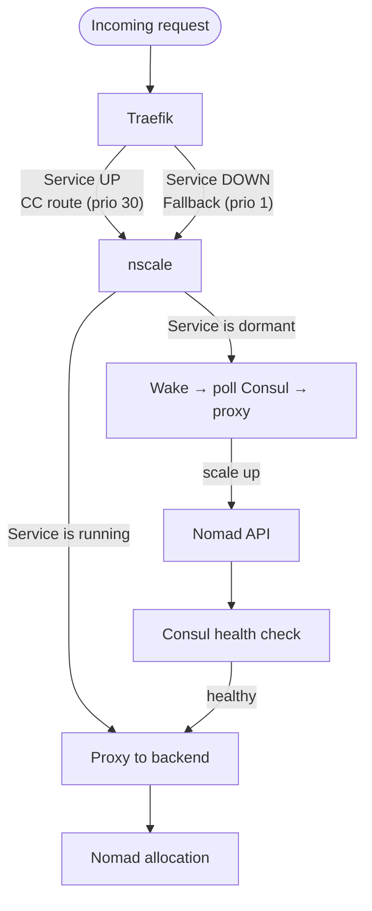
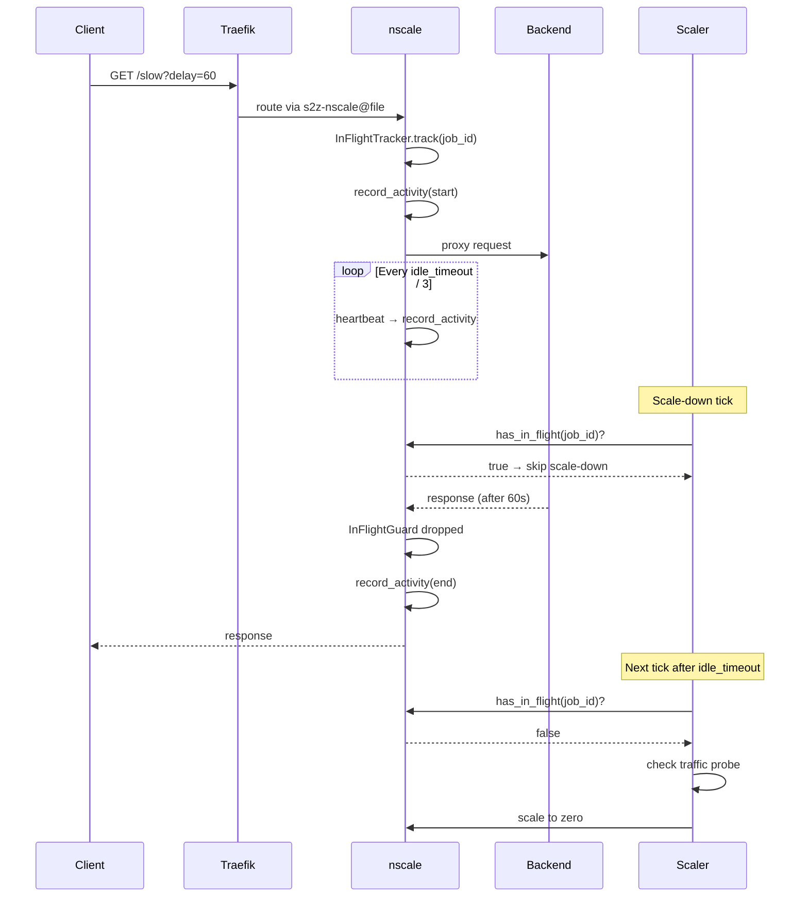
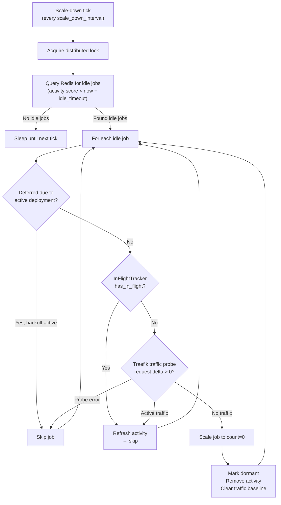

# nscale — Nomad Scale-to-Zero

[](LICENSE)

Transparent scale-to-zero and wake-on-request for [HashiCorp Nomad](https://www.nomadproject.io/) services.
**nscale** sits between Traefik and your Nomad jobs — when traffic arrives for a dormant service,
it wakes the job, proxies the request, and scales idle services back to zero when they go quiet.

## Architecture



### Routing paths

All traffic for nscale-managed services flows through nscale on **both** the cold and warm paths.
This ensures nscale has full visibility into in-flight requests and can prevent premature scale-down.



**Key insight:** ConsulCatalog routes use `traefik.http.routers.<name>.service=s2z-nscale@file`
to point back to nscale instead of directly to the Nomad allocation. This guarantees nscale
tracks every request, enabling in-flight protection and heartbeat-based activity recording.

### In-flight request protection

nscale prevents scale-down of services with active long-running requests using an
`InFlightTracker` with RAII guards and periodic heartbeats:



### Scale-down decision flow



**nscale** is a single Rust binary composed of seven internal crates:

| Crate | Purpose |
|-------|---------|
| `nscale-core` | Shared types, config (Figment), traits, `InFlightTracker` |
| `nscale-nomad` | Nomad API client — scale up/down, event stream |
| `nscale-consul` | Consul catalog — health checks, service discovery |
| `nscale-store` | Redis activity store (sorted set) and job registry |
| `nscale-proxy` | Reverse proxy with in-flight tracking and heartbeat |
| `nscale-waker` | Wake coordinator — request coalescing, state machine |
| `nscale-scaler` | Scale-down controller with traffic probe + in-flight guard |

## Features

- **Wake-on-request** — Dormant services are started automatically when traffic arrives
- **Request coalescing** — Concurrent requests for the same service share a single wake cycle
- **In-flight protection** — RAII-based `InFlightTracker` with heartbeat prevents scale-down during active requests
- **Heartbeat activity** — Long-running requests refresh activity every `idle_timeout / 3`, surviving any idle window
- **Reverse proxy** — All requests (cold and warm path) route through nscale for full visibility
- **Idle detection** — Services with no recent activity are scaled to zero via Redis sorted set
- **Traffic probe** — Scrapes Traefik Prometheus metrics as a secondary guard against scaling down active services
- **Retry with cache invalidation** — On upstream failure, invalidates stale endpoints and retries the full wake cycle
- **Nomad event stream** — Reacts to allocation lifecycle events for instant state transitions
- **Active-deployment tolerance** — Gracefully handles Nomad 400 "scaling blocked due to active deployment"
- **Bounded concurrency** — Configurable limit on simultaneous Nomad scale operations

Additional operator docs live in [`docs/`](./docs/), starting with the
[`performance-configuration.md`](./docs/performance-configuration.md) guide and the
[`job-submission.md`](./docs/job-submission.md) guide for the new admin submission flow.

## Quick Start

### Prerequisites

- [Docker](https://docs.docker.com/get-docker/) and Docker Compose
- [Nomad](https://developer.hashicorp.com/nomad/install) 1.10+
- [Consul](https://developer.hashicorp.com/consul/install) 1.18+

### Run with Docker Compose

The integration stack brings up Nomad, Consul, Redis, Traefik, and nscale:

```bash
cd integration
bash traefik/certs/generate.sh
docker compose up -d
```

Submit a sample job through nscale:

```bash
# Build a safe JSON payload from the sample HCL fixture
curl -X POST http://localhost:9090/admin/jobs \
  -H 'Content-Type: application/json' \
  --data "$(jq -n \
    --rawfile hcl jobs/echo-submit.nomad \
    --arg variables $'service_name = \"echo-s2z\"\nhost_name = \"echo-s2z.localhost\"' \
    '{hcl: $hcl, variables: $variables}')"
```

Send a request — nscale wakes the service and proxies the response:

```bash
curl -H "Host: echo-s2z.localhost" http://localhost:80/

# HTTPS works too (Traefik terminates TLS; -k accepts the local self-signed cert)
curl -k --resolve 'echo-s2z.localhost:443:127.0.0.1' https://echo-s2z.localhost/
```

### Build from source

```bash
cargo build --release
./target/release/nscale
```

### Docker

```bash
docker build -t nscale .
docker run -p 8080:8080 -p 9090:9090 nscale
```

## Configuration

nscale uses [Figment](https://docs.rs/figment) for layered configuration:
**Environment variables > TOML file > Defaults**.

### TOML (`config/default.toml`)

```toml
[default]
listen_addr = "0.0.0.0:8080"
admin_addr  = "0.0.0.0:9090"

[default.nomad]
addr        = "http://localhost:4646"
concurrency = 50

[default.consul]
addr = "http://localhost:8500"

[default.redis]
url = "redis://localhost:6379"

[default.scaling]
idle_timeout_secs        = 300
wake_timeout_secs        = 60
scale_down_interval_secs = 30
min_scale_down_age_secs  = 120

[default.proxy]
request_timeout_secs = 30
request_buffer_size  = 1000

[default.routing]
file_provider_service = "s2z-nscale@file"
```

### Environment variables

All settings can be overridden with `NSCALE_` prefixed env vars.
Nested keys use **double underscores** (Figment `.split("__")`).

| Variable | Default | Description |
|----------|---------|-------------|
| `NSCALE_LISTEN_ADDR` | `0.0.0.0:8080` | Proxy listen address |
| `NSCALE_ADMIN_ADDR` | `0.0.0.0:9090` | Admin/health listen address |
| `NSCALE_NOMAD__ADDR` | `http://localhost:4646` | Nomad API address |
| `NSCALE_NOMAD__TOKEN` | — | Nomad ACL token (optional) |
| `NSCALE_NOMAD__CONCURRENCY` | `50` | Max concurrent Nomad operations |
| `NSCALE_CONSUL__ADDR` | `http://localhost:8500` | Consul API address |
| `NSCALE_CONSUL__TOKEN` | — | Consul ACL token (optional) |
| `NSCALE_REDIS__URL` | `redis://localhost:6379` | Redis connection URL |
| `NSCALE_SCALING__IDLE_TIMEOUT_SECS` | `300` | Seconds before idle service is scaled down |
| `NSCALE_SCALING__WAKE_TIMEOUT_SECS` | `60` | Max seconds to wait for a service to become healthy |
| `NSCALE_SCALING__SCALE_DOWN_INTERVAL_SECS` | `30` | Scale-down sweep interval |
| `NSCALE_SCALING__MIN_SCALE_DOWN_AGE_SECS` | `120` | Minimum job age before scale-down eligibility (reserved for future runtime wiring) |
| `NSCALE_PROXY__REQUEST_TIMEOUT_SECS` | `30` | Upstream request timeout |
| `NSCALE_PROXY__REQUEST_BUFFER_SIZE` | `1000` | Request wake buffer size (reserved for future runtime wiring) |
| `NSCALE_ROUTING__FILE_PROVIDER_SERVICE` | `s2z-nscale@file` | Traefik service target injected into router tags during `/admin/jobs` submissions |
| `NSCALE_TRAEFIK__METRICS_URL` | — | Traefik Prometheus endpoint (enables traffic probe) |
| `NSCALE_TRAEFIK__PROVIDER` | — | Traefik provider name for metric labels |
| `RUST_LOG` | `info,nscale=debug` | Tracing filter |

## Traefik Integration

nscale requires specific Traefik configuration to ensure all traffic flows through it.

### Static config (`traefik.yml`)

```yaml
providers:
  file:
    filename: /etc/traefik/dynamic.yml
  consulCatalog:
    exposedByDefault: false
    strictChecks:
      - "passing"
      - "warning"
```

> **Important:** `strictChecks` must be a list of health status strings, not a boolean.
> Setting `strictChecks: true` is silently interpreted as the literal string `"true"`,
> causing all ConsulCatalog services to be rejected.

### Dynamic config (`dynamic.yml`)

```yaml
http:
  routers:
    s2z-fallback:
      rule: "HostRegexp(`^[a-z0-9-]+\\.localhost$`)"
      priority: 1
      entryPoints: [http]
      service: s2z-nscale

    s2z-fallback-https:
      rule: "HostRegexp(`^[a-z0-9-]+\\.localhost$`)"
      priority: 1
      entryPoints: [https]
      tls: {}
      service: s2z-nscale

  services:
    s2z-nscale:
      loadBalancer:
        passHostHeader: true
        servers:
          - url: "http://nscale:8080"

tls:
  certificates:
    - certFile: /etc/traefik/certs/server.crt
      keyFile: /etc/traefik/certs/server.key
```

### TLS / HTTPS

`nscale` itself still speaks plain HTTP on the inside. HTTPS support is provided by
**Traefik TLS termination**:

- clients connect to Traefik on `:443`
- Traefik terminates TLS and forwards to `http://nscale:8080`
- `nscale` still proxies to plain-HTTP Nomad allocations unless your deployment adds a separate upstream TLS layer

For cold-start over HTTPS to work, every TLS entrypoint must also have a fallback file-provider
router pointing at `s2z-nscale`. Otherwise warm traffic may work while cold HTTPS requests return
Traefik `404` before `nscale` can wake the job.

The integration stack ships a local self-signed certificate for `localhost` / `*.localhost` via
`integration/traefik/certs/generate.sh`. Production deployments should replace that with their own
certificate or ACME resolver setup.

### Nomad job tags

Services must route through nscale on both cold and warm paths.
If you submit jobs directly to Nomad, include `service=s2z-nscale@file` yourself.
If you submit through `/admin/jobs`, nscale injects or overrides this tag automatically
for every Traefik-enabled service that already declares explicit router tags.

Use `service=s2z-nscale@file` to point the ConsulCatalog router at nscale:

```hcl
service {
  name     = "my-service"
  provider = "consul"
  port     = "http"

  tags = [
    "traefik.enable=true",
    "traefik.http.routers.my-service.rule=Host(`my-service.localhost`)",
    "traefik.http.routers.my-service.entryPoints=http,https",
    "traefik.http.routers.my-service.tls=true",
    "traefik.http.routers.my-service.service=s2z-nscale@file",
  ]

  check {
    type     = "http"
    path     = "/"
    interval = "2s"
    timeout  = "1s"
  }
}
```

This creates two routes to nscale:

| Route | Provider | Priority | When active |
|-------|----------|----------|-------------|
| `my-service@consulcatalog` | ConsulCatalog | 30 | Service is running (healthy in Consul) |
| `s2z-fallback@file` | File | 1 | Always (catches dormant services) |

### Job submission via `/admin/jobs`

The admin submission endpoint lets nscale own the full registration flow:

1. parse Nomad HCL with optional variables through Nomad's parser
2. inject or override `traefik.http.routers.<name>.service=s2z-nscale@file`
3. submit the mutated job to Nomad
4. auto-register every managed service in Redis
5. seed initial activity so the scaler can safely discover the job later

The endpoint only manages services that:

- set `traefik.enable=true`
- include at least one explicit router tag like `traefik.http.routers.api.rule=...`

Router TLS tags such as `traefik.http.routers.api.entryPoints=http,https` and
`traefik.http.routers.api.tls=true` are preserved exactly as submitted. `nscale` only injects
or overrides the `.service=s2z-nscale@file` target.

Non-Traefik services are ignored. Traefik-enabled services without explicit router tags are rejected,
because nscale has no router name to target for the injected `.service=` override.

## Admin API

| Method | Path | Description |
|--------|------|-------------|
| `GET` | `/healthz` | Liveness check |
| `GET` | `/readyz` | Readiness check (verifies Redis) |
| `POST` | `/admin/jobs` | Parse HCL, inject required Traefik routing tags, submit to Nomad, auto-register managed services |
| `POST` | `/admin/registry` | Register a single job (seeds activity) |
| `POST` | `/admin/registry/sync` | Bulk-sync all job registrations (seeds activity) |

### Job submission payload

```json
{
  "hcl": "job \"echo-submit-job\" { ... }",
  "variables": "service_name = \"echo-s2z\"\nhost_name = \"echo-s2z.localhost\""
}
```

`variables` is optional. When present, it is passed straight through to Nomad's HCL parser.
Keep variable interpolation inside attribute values — Nomad does not allow template expressions
inside block labels such as `job "${var.name}"`.

Successful responses include the Nomad evaluation information plus the set of managed services that
nscale registered automatically.

### Manual registration payload

```json
{
  "job_id": "my-service",
  "service_name": "my-service",
  "nomad_group": "main"
}
```

Registration seeds an activity timestamp in Redis so the scaler can detect the job
as idle once `idle_timeout` expires. Without this, registered jobs would never be
discovered by the scale-down controller.

This endpoint is still useful when jobs are submitted outside nscale and you only need
to register an already-known service.

## Testing

### Unit tests

```bash
cargo nextest run --workspace
```

### Integration / stress tests (k6)

```bash
cd integration

# Multi-service chaos (50 services + random kills)
docker compose --profile stress run --rm \
  -e NSCALE_JOB_COUNT=50 \
  -e NSCALE_DURATION=90s \
  k6 run /scripts/multi-service.js
```

### Admin submission flow

```bash
cd integration
./test.sh
```

The main integration script now submits `jobs/echo-submit.nomad` through `/admin/jobs`, verifies
that nscale injected the Traefik service override tag in Consul, confirms lookup still works when
`service_name` differs from `job_id`, and then exercises wake-up and automatic scale-down.

### Multi-job management

```bash
cd integration

# Submit and register 50 jobs
bash scripts/multi-job.sh submit 50

# Check status
bash scripts/multi-job.sh status 50

# Teardown
bash scripts/multi-job.sh teardown 50
```

## How It Works

### 1. Submission and registration

A Nomad job can be submitted through `/admin/jobs`. nscale parses the HCL via Nomad,
injects the Traefik router service override, submits the mutated job, stores the managed
services in Redis, and seeds an initial activity timestamp. The job can be at any count —
nscale will scale it down once `idle_timeout` expires if there's no traffic.

If you submit jobs outside nscale, use `/admin/registry` or `/admin/registry/sync` to add
the same registration data manually.

### 2. Cold-start wake

When all allocations are stopped, the ConsulCatalog route disappears. Traefik
falls through to the `s2z-fallback` route (priority 1) → nscale. nscale looks
up the job in its registry, calls Nomad to scale up, polls Consul for a healthy
endpoint, then proxies the original request.

### 3. Warm-path proxy

When the service is healthy, Traefik creates a ConsulCatalog route (priority 30)
that also points to `s2z-nscale@file`. The request still flows through nscale,
which tracks it with `InFlightTracker`, spawns a heartbeat, and proxies to the
real backend using the coordinator's cached endpoint (resolved from Consul during wake).

### 4. In-flight protection

Each proxied request increments an atomic counter via `InFlightTracker.track()`,
returning an RAII guard that decrements on drop. A background heartbeat task
refreshes activity in Redis every `idle_timeout / 3`. The scale-down controller
checks `has_in_flight()` before any scale operation — if requests are active,
it refreshes activity and skips.

### 5. Scale down

The scale-down controller runs a periodic sweep:

1. Acquire distributed lock in Redis
2. Query the activity sorted set for jobs with score < `now - idle_timeout`
3. For each idle job, check deployment deferral (skip if Nomad reported active deployment recently)
4. Check `InFlightTracker` (in-flight requests block scale-down and refresh activity)
5. Check Traefik traffic probe (request counter delta; fail-open on probe errors)
6. If truly idle, scale Nomad job to `count = 0`
7. Mark dormant, remove activity, and clear the traffic probe baseline

### 6. Nomad event stream

nscale subscribes to Nomad's allocation event stream. When allocations transition
to running, it records activity. When they stop, it marks the job dormant and
clears the coordinator cache — enabling instant state transitions without polling.

## Project Structure

```
├── Cargo.toml              # Workspace + binary definition
├── docs/                   # Operator-facing guides and configuration docs
├── src/main.rs             # Binary entrypoint
├── crates/
│   ├── nscale-core/        # Config, traits, shared types
│   ├── nscale-nomad/       # Nomad API client
│   ├── nscale-consul/      # Consul catalog client
│   ├── nscale-store/       # Redis activity store + job registry
│   ├── nscale-proxy/       # Reverse proxy + activity middleware
│   ├── nscale-waker/       # Wake coordinator (state machine)
│   └── nscale-scaler/      # Scale-down controller + traffic probe
├── config/
│   └── default.toml        # Default configuration
├── integration/
│   ├── docker-compose.yml  # Full local stack
│   ├── jobs/               # Sample Nomad job specs
│   ├── k6/                 # Stress & chaos test scripts
│   ├── scripts/            # Helper scripts
│   └── traefik/            # Traefik configuration
├── Dockerfile              # Multi-stage production build
├── Dockerfile.release      # Lean release image using pre-built binaries
├── CHANGELOG.md
├── CONTRIBUTING.md
└── LICENSE                 # Apache 2.0
```

## License

Apache 2.0 — see [LICENSE](LICENSE).
