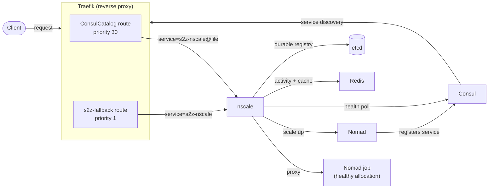
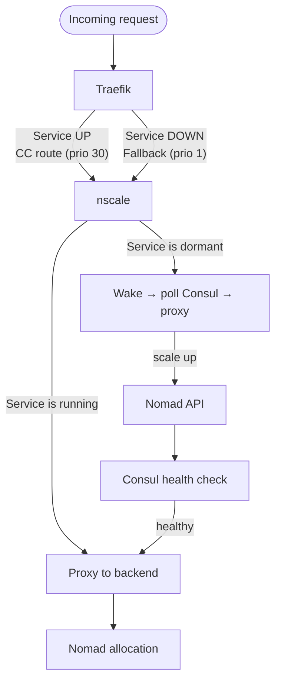
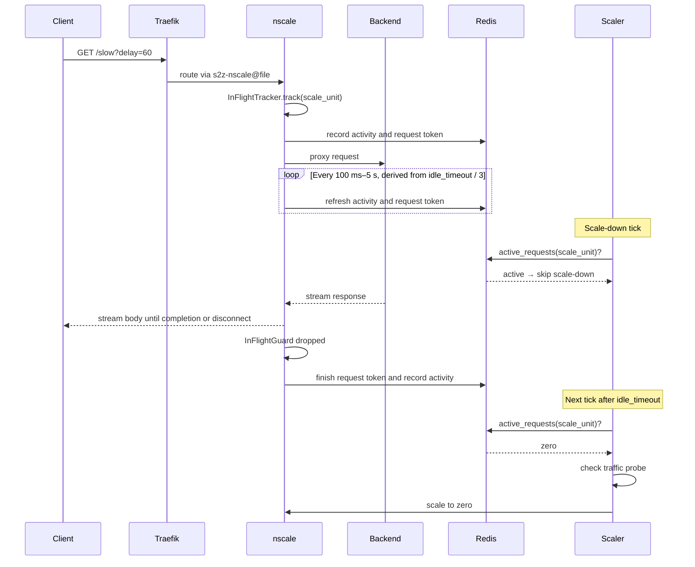
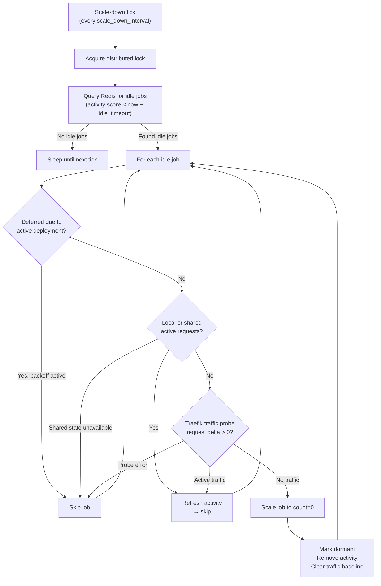

# nscale — Nomad Scale-to-Zero

[](LICENSE)

Transparent scale-to-zero and wake-on-request for [HashiCorp Nomad](https://www.nomadproject.io/) services.
**nscale** sits between Traefik and your Nomad jobs — when traffic arrives for a dormant service,
it wakes the job, proxies the request, and scales idle services back to zero when they go quiet.

## Architecture


```mermaid
graph LR
    Client([Client]) -->|request| Traefik

    subgraph Traefik["Traefik (reverse proxy)"]
        CC["ConsulCatalog route<br/>priority 30"]
        Fallback["s2z-fallback route<br/>priority 1"]
    end

    CC -->|"service=s2z-nscale#64;file"| nscale
    Fallback -->|"service=s2z-nscale"| nscale

    nscale -->|proxy| Backend["Nomad job<br/>(healthy allocation)"]
    nscale -->|scale up| Nomad
    nscale -->|health poll| Consul
    nscale -->|activity + cache| Redis
    nscale -->|durable registry| Etcd[(etcd)]

    Nomad -->|registers service| Consul
    Consul -->|service discovery| Traefik
```

### Routing paths

All traffic for nscale-managed services flows through nscale on **both** the cold and warm paths.
This ensures nscale has full visibility into in-flight requests and can prevent premature scale-down.


```mermaid
graph TD
    Request([Incoming request]) --> Traefik

    Traefik -->|"Service UP<br/>CC route (prio 30)"| nscale
    Traefik -->|"Service DOWN<br/>Fallback (prio 1)"| nscale

    nscale -->|Service is running| Proxy["Proxy to backend"]
    nscale -->|Service is dormant| Wake["Wake → poll Consul → proxy"]

    Proxy --> Backend["Nomad allocation"]
    Wake -->|scale up| Nomad["Nomad API"]
    Nomad --> Consul["Consul health check"]
    Consul -->|healthy| Proxy
```

**Key insight:** ConsulCatalog routes use `traefik.http.routers.<name>.service=s2z-nscale@file`
to point back to nscale instead of directly to the Nomad allocation. This guarantees nscale
tracks every request, enabling in-flight protection and heartbeat-based activity recording.

### In-flight request protection

nscale guards reductions using local `InFlightTracker` guards and shared Redis request leases,
kept alive through HTTP response completion or WebSocket closure:


```mermaid
sequenceDiagram
    participant Client
    participant Traefik
    participant nscale
    participant Backend
    participant Redis
    participant Scaler

    Client->>Traefik: GET /slow?delay=60
    Traefik->>nscale: route via s2z-nscale@file
    nscale->>nscale: InFlightTracker.track(scale_unit)
    nscale->>Redis: record activity and request token
    nscale->>Backend: proxy request

    loop Every 100 ms–5 s, derived from idle_timeout / 3
        nscale->>Redis: refresh activity and request token
    end

    Note over Scaler: Scale-down tick
    Scaler->>Redis: active_requests(scale_unit)?
    Redis-->>Scaler: active → skip scale-down

    Backend-->>nscale: stream response
    nscale-->>Client: stream body until completion or disconnect
    nscale->>nscale: InFlightGuard dropped
    nscale->>Redis: finish request token and record activity

    Note over Scaler: Next tick after idle_timeout
    Scaler->>Redis: active_requests(scale_unit)?
    Redis-->>Scaler: zero
    Scaler->>Scaler: check traffic probe
    Scaler->>nscale: scale to zero
```

### Scale-down decision flow


```mermaid
flowchart TD
    Tick["Scale-down tick<br/>(every scale_down_interval)"] --> Lock["Acquire distributed lock"]
    Lock --> Idle["Query Redis for idle jobs<br/>(activity score < now − idle_timeout)"]
    Idle -->|No idle jobs| Done["Sleep until next tick"]
    Idle -->|Found idle jobs| Loop["For each idle job"]
    Loop --> Deferred{"Deferred due to<br/>active deployment?"}
    Deferred -->|Yes, backoff active| Skip["Skip job"]
    Deferred -->|No| InFlight{"Local or shared<br/>active requests?"}
    InFlight -->|Shared state unavailable| Skip
    InFlight -->|Yes| Refresh["Refresh activity<br/>→ skip"]
    InFlight -->|No| Probe{"Traefik traffic probe<br/>request delta > 0?"}
    Probe -->|Active traffic| Refresh
    Probe -->|Probe error| Skip
    Probe -->|No traffic| Scale["Scale job to count=0"]
    Scale --> Cleanup["Mark dormant<br/>Remove activity<br/>Clear traffic baseline"]
    Refresh --> Loop
    Skip --> Loop
    Cleanup --> Loop
```

**nscale** is a single Rust binary composed of eight internal crates:

| Crate | Purpose |
|-------|---------|
| `nscale-core` | Shared types, config (Figment), traits, `InFlightTracker` |
| `nscale-nomad` | Nomad API client — scale up/down, event stream |
| `nscale-consul` | Consul catalog — health checks, service discovery |
| `nscale-store` | Redis activity store (sorted set) and registry cache |
| `nscale-etcd` | Durable job-registration store used as the registry source of truth |
| `nscale-proxy` | Reverse proxy with in-flight tracking and heartbeat |
| `nscale-waker` | Wake coordinator — request coalescing, state machine |
| `nscale-scaler` | Scale-down controller with traffic probe + in-flight guard |

## Features

- **Wake-on-request** — Dormant services start at the enabled policy’s minimum; failed wakes are coalesced and queue time counts toward the wake deadline
- **Per-group autoscaling** — Per-job policies control running capacity using request rate, latency, and error signals; missing required metrics prevent reductions
- **Request coalescing** — Concurrent requests for the same service share a single wake cycle
- **In-flight protection** — Local guards and renewable Redis request leases track HTTP bodies and WebSocket tunnels across proxy replicas
- **Heartbeat activity** — Requests refresh activity and their Redis lease every `idle_timeout / 3`, clamped to 100 ms–5 s; leases expire after 30 s without renewal
- **Reverse proxy** — All requests (cold and warm path) route through nscale for full visibility
- **Idle detection** — Services with no recent activity are scaled to zero via Redis sorted set
- **Durable registry** — Job registrations can be stored in etcd and cached in Redis for resilient multi-replica recovery
- **Traffic probe** — Scrapes Traefik Prometheus metrics as a secondary guard against scaling down active services
- **Safe transport retries** — Only empty-body GET/HEAD requests are replayed, preserving headers, URI, method, and HTTP version
- **Nomad event stream** — Reacts to allocation lifecycle events for instant state transitions
- **Active-deployment tolerance** — Gracefully handles Nomad 400 "scaling blocked due to active deployment"
- **Bounded concurrency** — Configurable limit on simultaneous Nomad scale operations

Additional operator docs live in [`docs/`](./docs/), starting with the
[`performance-configuration.md`](./docs/performance-configuration.md) guide,
[`job-submission.md`](./docs/job-submission.md) for the admin submission flow,
and [`durable-registry.md`](./docs/durable-registry.md) for etcd-backed registry mode.

### Upgrading from 2.2.x

Follow the [autoscaling migration guide](./docs/migration-autoscaling.md) before upgrading.
This update requires a controlled drain/stop/start cutover, a non-evicting shared Redis store,
registration reconciliation for multi-group jobs, and a tested rollback. Pin the target image;
the chart and Cargo packages now target `3.0.0`. The chart uses `Recreate` and non-evicting Redis
by default; review inherited Helm values because custom Redis settings are preserved.

### Autoscaling release status

The latest validation passed **167 workspace tests** with infrastructure tests enabled,
plus the durable integration suite. Previously identified release blockers have fixes and
regressions. The final registration/wake changes have not yet had all four earlier
integration suites rerun, and staging rollout, rollback, and prolonged soak remain unverified.
See [release readiness](./docs/autoscaling-release-readiness.md) for the evidence and remaining
production gates. This is a staging candidate, not production sign-off.

## Quick Start

### Prerequisites

- [Docker](https://docs.docker.com/get-docker/) and Docker Compose
- [Nomad](https://developer.hashicorp.com/nomad/install) 1.10+
- [Consul](https://developer.hashicorp.com/consul/install) 1.18+

### Run with Docker Compose

The integration stack brings up Nomad, Consul, Redis, Traefik, and nscale:

```bash
cd integration
bash traefik/certs/generate.sh
docker compose up -d
```

Submit a sample job through nscale:

```bash
# Build a safe JSON payload from the sample HCL fixture
curl -X POST http://localhost:9090/admin/jobs \
  -H 'Content-Type: application/json' \
  --data "$(jq -n \
    --rawfile hcl jobs/echo-submit.nomad \
    --arg variables $'service_name = \"echo-s2z\"\nhost_name = \"echo-s2z.localhost\"' \
    '{hcl: $hcl, variables: $variables}')"
```

Send a request — nscale wakes the service and proxies the response:

```bash
curl -H "Host: echo-s2z.localhost" http://localhost:80/

# HTTPS works too (Traefik terminates TLS; -k accepts the local self-signed cert)
curl -k --resolve 'echo-s2z.localhost:443:127.0.0.1' https://echo-s2z.localhost/
```

### Build from source

```bash
cargo build --release
./target/release/nscale
```

### Docker

```bash
docker build -t nscale .
docker run -p 8080:8080 -p 9090:9090 nscale
```

## Helm Installation

A Helm chart is available under [`charts/nscale/`](./charts/nscale/) for Kubernetes deployments.
The chart always deploys `nscale`, supports external Nomad and Consul endpoints, and can
optionally bundle Redis and etcd for durable-registry mode.

### Prerequisites

- a Kubernetes cluster with network reachability to Nomad and Consul
- Traefik configured separately so both cold-path and warm-path traffic route through `nscale`
- Redis available either externally or via `redis.enabled=true`
- optional: etcd available externally or via `etcd.enabled=true` when durable registry mode is enabled

### Install with bundled Redis

```bash
helm install nscale ./charts/nscale \
  --namespace nscale \
  --create-namespace \
  --set redis.enabled=true \
  --set externalServices.nomad.addr=http://nomad.default.svc.cluster.local:4646 \
  --set externalServices.consul.addr=http://consul.default.svc.cluster.local:8500
```

### Enable durable registry mode

```bash
helm install nscale ./charts/nscale \
  --namespace nscale \
  --create-namespace \
  --set redis.enabled=true \
  --set registry.durable.enabled=true \
  --set etcd.enabled=true \
  --set externalServices.nomad.addr=http://nomad.default.svc.cluster.local:4646 \
  --set externalServices.consul.addr=http://consul.default.svc.cluster.local:8500
```

If you already run Redis or etcd elsewhere, keep the bundled services disabled and point the chart
at your existing endpoints instead.

For the full values reference, secret handling, and additional examples, see
[`charts/nscale/README.md`](./charts/nscale/README.md).

## Configuration

nscale uses [Figment](https://docs.rs/figment) for layered configuration:
**Environment variables > TOML file > Defaults**.

### TOML (`config/default.toml`)

```toml
[default]
listen_addr = "0.0.0.0:8080"
admin_addr  = "0.0.0.0:9090"

[default.nomad]
addr        = "http://localhost:4646"
concurrency = 50

[default.consul]
addr = "http://localhost:8500"

[default.redis]
url = "redis://localhost:6379"

[default.scaling]
idle_timeout_secs        = 300
wake_timeout_secs        = 60
scale_down_interval_secs = 30
min_scale_down_age_secs  = 120

[default.scaling.auto_deregister]
enabled             = true
not_found_threshold = 5

[default.proxy]
request_timeout_secs = 30
request_buffer_size  = 1000

[default.routing]
file_provider_service = "s2z-nscale@file"
```

Prometheus is optional and is not enabled by default. To query Prometheus before the
direct Traefik and nscale-native fallback providers, add:

```toml
[default.prometheus]
url = "http://prometheus:9090"
timeout_secs = 5
```

### Environment variables

All settings can be overridden with `NSCALE_` prefixed env vars.
Nested keys use **double underscores** (Figment `.split("__")`).

| Variable | Default | Description |
|----------|---------|-------------|
| `NSCALE_LISTEN_ADDR` | `0.0.0.0:8080` | Proxy listen address |
| `NSCALE_ADMIN_ADDR` | `0.0.0.0:9090` | Admin/health listen address |
| `NSCALE_ADMIN__TOKEN` | — | Bearer token required for privileged `/admin/*` endpoints (optional; unauthenticated when unset) |
| `NSCALE_NOMAD__ADDR` | `http://localhost:4646` | Nomad API address |
| `NSCALE_NOMAD__TOKEN` | — | Nomad ACL token (optional) |
| `NSCALE_NOMAD__CONCURRENCY` | `50` | Max concurrent Nomad operations |
| `NSCALE_CONSUL__ADDR` | `http://localhost:8500` | Consul API address |
| `NSCALE_CONSUL__TOKEN` | — | Consul ACL token (optional) |
| `NSCALE_REDIS__URL` | `redis://localhost:6379` | Redis connection URL |
| `NSCALE_PROMETHEUS__URL` | — | Prometheus API URL (optional); when configured, queried before direct providers |
| `NSCALE_PROMETHEUS__TIMEOUT_SECS` | `5` | Prometheus query timeout |
| `NSCALE_REGISTRY__DURABLE_ENABLED` | `false` | Enable etcd-backed durable registrations and Redis read-through cache |
| `NSCALE_REGISTRY__ETCD_ENDPOINTS` | `http://localhost:2379` | Comma-separated etcd endpoints |
| `NSCALE_REGISTRY__ETCD_KEY_PREFIX` | `/nscale/registrations` | etcd key prefix used for registrations |
| `NSCALE_REGISTRY__ETCD_WATCH_BACKOFF_SECS` | `5` | Reserved for future watch/reconciliation backoff wiring; currently ignored |
| `NSCALE_SCALING__IDLE_TIMEOUT_SECS` | `300` | Seconds before idle service is scaled down |
| `NSCALE_SCALING__WAKE_TIMEOUT_SECS` | `60` | Max seconds to wait for a service to become healthy |
| `NSCALE_SCALING__SCALE_DOWN_INTERVAL_SECS` | `30` | Scale-down sweep interval |
| `NSCALE_SCALING__MIN_SCALE_DOWN_AGE_SECS` | `120` | Minimum job age before scale-down eligibility (reserved for future runtime wiring) |
| `NSCALE_SCALING__AUTO_DEREGISTER__ENABLED` | `true` | Enable cleanup of stale registrations after repeated Nomad missing-job responses |
| `NSCALE_SCALING__AUTO_DEREGISTER__NOT_FOUND_THRESHOLD` | `5` | Consecutive Nomad missing-job responses before `nscale` forgets a job |
| `NSCALE_PROXY__REQUEST_TIMEOUT_SECS` | `30` | Upstream request timeout |
| `NSCALE_PROXY__REQUEST_BUFFER_SIZE` | `1000` | Request wake buffer size (reserved for future runtime wiring) |
| `NSCALE_ROUTING__FILE_PROVIDER_SERVICE` | `s2z-nscale@file` | Traefik service target injected into router tags during `/admin/jobs` submissions |
| `NSCALE_TRAEFIK__METRICS_URL` | — | Traefik Prometheus endpoint (enables traffic probe) |
| `NSCALE_TRAEFIK__PROVIDER` | — | Traefik provider name for metric labels |
| `RUST_LOG` | `info,nscale=debug` | Tracing filter |
| `NSCALE_LOG_FORMAT` | auto | Log output format: `compact`, `pretty`, or `json` (see below) |

When `NSCALE_PROMETHEUS__URL` or `[default.prometheus]` is configured, nscale queries
Prometheus before the direct Traefik and nscale-native fallback providers.

## Logging

nscale uses [`tracing-subscriber`](https://docs.rs/tracing-subscriber) for structured logging.
Filter verbosity with `RUST_LOG` and control the output format with `NSCALE_LOG_FORMAT`.

### Log formats

| Value | Description | Typical use |
|-------|-------------|-------------|
| `compact` | Plain text, no ANSI colour codes | Docker / Kubernetes / any non-TTY environment |
| `pretty` | Human-friendly output with ANSI colour | Interactive local development |
| `json` | One JSON object per log line | Log aggregators (Loki, CloudWatch, Datadog, …) |

When `NSCALE_LOG_FORMAT` is not set nscale **auto-detects** the right default:

- stdout is a TTY → `pretty` (coloured output for the terminal)
- stdout is not a TTY → `compact` (plain text, safe for container runtimes)

**Examples**

```sh
# Plain text for a Docker Compose deployment (also the automatic default):
NSCALE_LOG_FORMAT=compact docker compose up

# JSON for a Kubernetes deployment that ships logs to Loki:
NSCALE_LOG_FORMAT=json ./nscale

# Coloured output forced on even when piped:
NSCALE_LOG_FORMAT=pretty ./nscale 2>&1 | tee nscale.log
```

## Traefik Integration

nscale requires specific Traefik configuration to ensure all traffic flows through it.

### Static config (`traefik.yml`)

```yaml
providers:
  file:
    filename: /etc/traefik/dynamic.yml
  consulCatalog:
    exposedByDefault: false
    strictChecks:
      - "passing"
      - "warning"
```

> **Important:** `strictChecks` must be a list of health status strings, not a boolean.
> Setting `strictChecks: true` is silently interpreted as the literal string `"true"`,
> causing all ConsulCatalog services to be rejected.

### Dynamic config (`dynamic.yml`)

```yaml
http:
  routers:
    s2z-fallback:
      rule: "HostRegexp(`^[a-z0-9-]+\\.localhost$`)"
      priority: 1
      entryPoints: [http]
      service: s2z-nscale

    s2z-fallback-https:
      rule: "HostRegexp(`^[a-z0-9-]+\\.localhost$`)"
      priority: 1
      entryPoints: [https]
      tls: {}
      service: s2z-nscale

  services:
    s2z-nscale:
      loadBalancer:
        passHostHeader: true
        servers:
          - url: "http://nscale:8080"

tls:
  certificates:
    - certFile: /etc/traefik/certs/server.crt
      keyFile: /etc/traefik/certs/server.key
```

### TLS / HTTPS

`nscale` itself still speaks plain HTTP on the inside. HTTPS support is provided by
**Traefik TLS termination**:

- clients connect to Traefik on `:443`
- Traefik terminates TLS and forwards to `http://nscale:8080`
- `nscale` still proxies to plain-HTTP Nomad allocations unless your deployment adds a separate upstream TLS layer

For cold-start over HTTPS to work, every TLS entrypoint must also have a fallback file-provider
router pointing at `s2z-nscale`. Otherwise warm traffic may work while cold HTTPS requests return
Traefik `404` before `nscale` can wake the job.

The integration stack ships a local self-signed certificate for `localhost` / `*.localhost` via
`integration/traefik/certs/generate.sh`. Production deployments should replace that with their own
certificate or ACME resolver setup.

### Nomad job tags

Services must route through nscale on both cold and warm paths.
If you submit jobs directly to Nomad, include `service=s2z-nscale@file` yourself.
If you submit through `/admin/jobs`, nscale injects or overrides this tag automatically
for every Traefik-enabled service that already declares explicit router tags.

Use `service=s2z-nscale@file` to point the ConsulCatalog router at nscale:

```hcl
service {
  name     = "my-service"
  provider = "consul"
  port     = "http"

  tags = [
    "traefik.enable=true",
    "traefik.http.routers.my-service.rule=Host(`my-service.localhost`)",
    "traefik.http.routers.my-service.entryPoints=http,https",
    "traefik.http.routers.my-service.tls=true",
    "traefik.http.routers.my-service.service=s2z-nscale@file",
  ]

  check {
    type     = "http"
    path     = "/"
    interval = "2s"
    timeout  = "1s"
  }
}
```

This creates two routes to nscale:

| Route | Provider | Priority | When active |
|-------|----------|----------|-------------|
| `my-service@consulcatalog` | ConsulCatalog | 30 | Service is running (healthy in Consul) |
| `s2z-fallback@file` | File | 1 | Always (catches dormant services) |

### Job submission via `/admin/jobs`

The admin submission endpoint lets nscale own the full registration flow:

1. parse Nomad HCL with optional variables through Nomad's parser
2. inject or override `traefik.http.routers.<name>.service=s2z-nscale@file`
3. submit the mutated job to Nomad
4. replace the job’s managed registrations in Redis (and etcd when enabled), removing services absent from the submitted job
5. seed initial activity so the scaler can safely discover the job later

The endpoint only manages services that:

- set `traefik.enable=true`
- include at least one explicit router tag like `traefik.http.routers.api.rule=...`

Router TLS tags such as `traefik.http.routers.api.entryPoints=http,https` and
`traefik.http.routers.api.tls=true` are preserved exactly as submitted. `nscale` only injects
or overrides the `.service=s2z-nscale@file` target.

Non-Traefik services are ignored. Traefik-enabled services without explicit router tags are rejected,
because nscale has no router name to target for the injected `.service=` override.

## Admin API

| Method | Path | Description |
|--------|------|-------------|
| `GET` | `/healthz` | Liveness check |
| `GET` | `/readyz` | Readiness check (verifies Redis) |
| `GET` | `/metrics` | Prometheus metrics for nscale request, wake, and autoscaling signals |
| `GET` | `/admin/autoscaling` | List autoscaling-enabled registrations with current Nomad counts and policy details |
| `POST` | `/admin/jobs` | Parse HCL, inject required Traefik routing tags, submit to Nomad, auto-register managed services |
| `DELETE` | `/admin/jobs/:job_id` | Stop and purge a Nomad job, then remove `nscale` registry/activity state for that job |
| `POST` | `/admin/registry` | Register a single job (seeds activity) |
| `POST` | `/admin/registry/sync` | Bulk-sync all job registrations (seeds activity) |

The privileged `/admin/*` endpoints can be protected with a bearer token via
`admin.token` (`NSCALE_ADMIN__TOKEN`). When set, requests must send
`Authorization: Bearer <token>`; `/healthz`, `/readyz`, and `/metrics` stay open
for probes and scraping. When unset the admin API is unauthenticated and nscale
logs a startup warning — bind `admin_addr` to a trusted network in that case.

### Job submission payload

```json
{
  "hcl": "job \"echo-submit-job\" { ... }",
  "variables": "service_name = \"echo-s2z\"\nhost_name = \"echo-s2z.localhost\"",
  "autoscaling": {
    "max_count": 5,
    "min_count": 1,
    "scale_to_zero": true,
    "scale_up_step": 1,
    "scale_down_step": 1,
    "cooldown_secs": 20,
    "decision_window_secs": 30,
    "target_requests_per_second_per_instance": 25.0,
    "target_p95_latency_ms": 500.0,
    "max_error_rate": 0.05
  }
}
```

`variables` is optional. When present, it is passed straight through to Nomad's HCL parser.
Keep variable interpolation inside attribute values — Nomad does not allow template expressions
inside block labels such as `job "${var.name}"`.

`autoscaling` is optional and applies to every managed registration produced by the submitted job.
When present, `max_count` is required. Jobs without this object keep the existing scale-to-zero-only
behavior.

Successful responses include the Nomad evaluation information plus the set of managed services that
nscale registered automatically. A `201` response means the complete registration set was replaced.
A `409` means another job mutation holds the lease; retry the submission. A `207` means Nomad
accepted the job but registration replacement failed; inspect `registration_failures` and retry
after restoring the store. Nomad, etcd, and Redis do not share a transaction.

Concurrent requests for an unhealthy service share the same wake result. `wake_timeout_secs`
bounds each request’s entire wake attempt, including time queued for discovery refresh or
Nomad concurrency slots. A later request can retry a failed wake.

### Manual registration payload

```json
{
  "job_id": "my-service",
  "service_name": "my-service",
  "nomad_group": "main",
  "autoscaling": {
    "max_count": 5,
    "target_requests_per_second_per_instance": 25.0
  }
}
```

Registration seeds an activity timestamp in Redis so the scaler can detect the job
as idle once `idle_timeout` expires. Without this, registered jobs would never be
discovered by the scale-down controller.

This endpoint is still useful when jobs are submitted outside nscale and you only need
to register an already-known service.

### Per-job autoscaling

Autoscaling is configured only on individual job registrations. There is no global autoscaling
policy in `config/default.toml`.

If a registration has an `autoscaling` policy, the autoscaler evaluates that job periodically and
scales its Nomad task group between `min_count` and `max_count`. The autoscaler does not wake jobs
from zero and does not scale jobs to zero; wake-on-request and idle scale-down keep owning the
zero transitions. A cold request wakes an enabled policy directly to `min_count`
(default `1`); a cache miss or proxy restart preserves an already-running count.

Policy fields:

| Field | Default | Description |
|-------|---------|-------------|
| `max_count` | required | Hard cap for this job's autoscaled task-group count |
| `enabled` | `true` | Disable this job's autoscaling policy without removing it |
| `min_count` | `1` | Minimum running count and cold-wake count; must be at least `1` |
| `scale_to_zero` | `true` | Whether idle scale-down may still scale this job to zero |
| `scale_up_step` | `1` | Maximum instances added in one autoscale decision |
| `scale_down_step` | `1` | Maximum instances removed in one autoscale decision |
| `cooldown_secs` | `120` | Per-group cooldown after a successful autoscale decision (shared across replicas) |
| `decision_window_secs` | `60` | Optional per-job metrics window used for autoscale decisions (max `1800`) |
| `target_requests_per_second_per_instance` | optional | Traefik request-rate target per instance |
| `target_p95_latency_ms` | optional | p95 proxy latency target; aggregate Prometheus samples support reductions |
| `max_error_rate` | optional | Error-rate threshold used as a downscale guard and scale-up signal |

Traefik metrics provide the cluster-wide request-rate signal when `NSCALE_TRAEFIK__METRICS_URL` is
configured. nscale-native metrics provide request latency and local error-rate signals through the
admin `/metrics` endpoint. Replica-local latency and error samples can trigger scale-up,
but cannot independently authorize downscaling, including when Prometheus is unavailable
or returns no observations. Configure cluster-wide metrics for latency/error-driven
reductions; idle scale-to-zero still uses its separate activity and traffic guards.

> **Multi-group jobs:** a single Nomad job may expose more than one task group,
> each with its own service/router. nscale tracks idle state, wake, in-flight
> requests, Traefik traffic, and scale-to-zero **per task group**, so each group
> scales independently. Internally the scale-to-zero unit is the job id for
> single-group jobs (unchanged, no data migration) and a `job_id/group` composite
> for multi-group jobs.

Healthy backend endpoints are cached **per service**, selected round-robin, and refreshed every
`proxy.endpoint_refresh_secs` (default `2`, environment: `NSCALE_PROXY__ENDPOINT_REFRESH_SECS`).
Allocation-stop events invalidate discovery without resetting the group's desired count.
Sibling services share count-mutation coordination, but have separate readiness waits:
an unhealthy service does not make a healthy service in the same group fail.

Services sharing a group contribute their request rates to one decision. Latency/error checks use
the worst service signal; absent required observations block reductions while known overload can
still trigger scale-up. Router traffic is preferred
when present, with service traffic as a fallback, so the same request is not counted twice.

Job submission, wake, autoscaling, and idle scale-down share renewable Redis mutation leases per Nomad job.
Scaling writes enforce Nomad's job modification index and abandon stale decisions. In-flight request
leases are shared across proxy replicas and remain active through response-body completion or client
disconnection. Request leases refresh at most every five seconds and expire after thirty seconds
without renewal. New requests return `503` when Redis admission fails; reductions and unforced purge
are blocked when shared request state cannot be read.

Drain and replace older proxy replicas together when introducing this coordination protocol:
older versions do not publish shared request leases and cannot participate in these guarantees.

Configure application graceful shutdown and Nomad `shutdown_delay`/`kill_timeout` for the supported
request duration. Discovery refresh and distributed request guards reduce disruption but cannot make
arbitrary application termination or network partitions lossless.

### Manual purge endpoint

`DELETE /admin/jobs/:job_id`

This endpoint is the inverse of manual registration when you want `nscale` to forget a job
and Nomad to stop serving it entirely. The handler:

1. sends `DELETE /v1/job/:job_id?purge=true` to Nomad
2. clears the in-memory wake cache for that job
3. removes activity tracking
4. deregisters the job from Redis, and from etcd when durable registry mode is enabled

By default the request is rejected with `409 Conflict` if `nscale` is actively proxying
requests for that job. Pass `?force=true` to override that guard.

Use manual purge when the job should be gone. Use `/admin/registry` or `/admin/registry/sync`
when the job still exists but was submitted outside `nscale` and just needs to be registered.

## Testing

### Unit tests

```bash
cargo nextest run --workspace

# Include opt-in tests using disposable services, never production stores.
NSCALE_TEST_REDIS_URL=redis://127.0.0.1:58411 \
NSCALE_TEST_ETCD_ENDPOINT=http://127.0.0.1:58412 \
  cargo nextest run --workspace --run-ignored all --test-threads 4
```

### Autoscaling release regressions

```bash
# Builds a disposable two-proxy Nomad/Consul/Redis/Traefik stack.
bash integration/test-autoscaling-regressions.sh

# Isolated Redis component tests (requires an independently started test Redis).
NSCALE_TEST_REDIS_URL=redis://127.0.0.1:6379 \
  cargo nextest run -p nscale-store --test coordination --run-ignored only
```

The release regressions check allocation IDs in HTTP responses, minimum-count cold wake,
replica preservation across proxy restarts and allocation stops, cross-proxy streaming protection,
and metric-driven up/down scaling. They require free integration ports, including `18081` and
`19091`, and refuse to take over another Compose project's `nscale-net` network.

### Integration / stress tests (k6)

```bash
cd integration

# Multi-service chaos (50 services + random kills)
docker compose --profile stress run --rm \
  -e NSCALE_JOB_COUNT=50 \
  -e NSCALE_DURATION=90s \
  k6 run /scripts/multi-service.js
```

### Admin submission flow

```bash
cd integration
./test.sh
```

The main integration script now submits `jobs/echo-submit.nomad` through `/admin/jobs`, verifies
that nscale injected the Traefik service override tag in Consul, confirms lookup still works when
`service_name` differs from `job_id`, and then exercises wake-up and automatic scale-down.

### Per-job autoscaling flow

```bash
cd integration
./test-autoscaling.sh
```

The autoscaling integration suite submits policies through `/admin/jobs`; it does not use any global
autoscaling config file. It verifies invalid policy rejection, Traefik request-rate scale-up,
`max_count` caps under pressure, variable traffic scale-up/down, default `scale_to_zero = true`,
`scale_to_zero = false`, and nscale-native latency-driven scale-up. The suite requires Docker,
Docker Compose, curl, jq, and openssl.

To exercise the Prometheus-backed metrics provider, run the opt-in Prometheus suite:

```bash
cd integration
./test-autoscaling-prometheus.sh
```

This uses `docker-compose.prometheus.yml` to add Prometheus and a second proxy without changing
the default integration stack. Prometheus scrapes Traefik and both proxies; nscale runs with
`NSCALE_PROMETHEUS__URL=http://prometheus:9090`. The test checks real latency histogram buckets
from both proxies and their aggregated p95, then verifies autoscaling stays within `max_count`
and returns to zero. The second proxy uses local ports `18081` and `19091`.

For the full operational lifecycle test, run:

```bash
cd integration
./test-autoscaling-realworld.sh
```

This starts fast and slow services from zero, drives live traffic while polling Nomad counts,
verifies they scale to their per-job caps (`2` and `3`), then verifies both return to zero after
traffic stops. It also runs concurrent fast/slow pressure to check per-job isolation.

For many-job autoscaling stress, run:

```bash
cd integration
./autoscaling-stress-test.sh --start --job-count=10 --duration=180
```

The stress runner generates independent Nomad jobs from the autoscale echo fixture, submits per-job
autoscaling policies, starts all jobs from zero, drives concurrent pressure, reports per-job handled
requests and observed peak counts, verifies no job exceeds its cap, and then verifies each job returns
to zero. Large runs such as `--job-count=50` are capacity benchmarks for the local Nomad/Consul/Traefik
stack; not every job is expected to reach its cap on a constrained dev machine. Use `--require-caps`
for smaller deterministic runs where every job must reach its configured cap.

Autoscaling emits these Prometheus series on `/metrics`:

| Metric | Description |
|--------|-------------|
| `nscale_autoscale_current_count` | Last observed Nomad count per autoscaled job |
| `nscale_autoscale_desired_count` | Desired count from successful autoscale decisions |
| `nscale_autoscale_decisions_total` | Count of successful autoscale decisions by direction/reason |
| `nscale_autoscale_skips_total` | Count of skipped autoscale evaluations by reason |

### Durable registry mode

```bash
cd integration
./test-durable.sh
./test-durable-multi-replica.sh
```

The durable integration scripts enable etcd-backed registrations, verify Redis cache loss recovery,
and confirm that a second nscale replica can serve requests by reading through to etcd and
repopulating Redis.

### Multi-job management

```bash
cd integration

# Submit and register 50 jobs
bash scripts/multi-job.sh submit 50

# Check status
bash scripts/multi-job.sh status 50

# Teardown
bash scripts/multi-job.sh teardown 50
```

## How It Works

### 1. Submission and registration

A Nomad job can be submitted through `/admin/jobs`. nscale parses the HCL via Nomad,
injects the Traefik router service override, submits the mutated job, stores the managed
services in Redis, and seeds an initial activity timestamp. The job can be at any count —
nscale will scale it down once `idle_timeout` expires if there's no traffic.

If you submit jobs outside nscale, use `/admin/registry` or `/admin/registry/sync` to add
the same registration data manually.

If Nomad repeatedly reports that a registered job no longer exists, the
`scaling.auto_deregister` policy increments a shared Redis counter. Once the
consecutive missing-job count reaches `not_found_threshold` (default `5`),
`nscale` automatically clears the stale registration so future requests fail fast
with `404 Not Found` instead of repeatedly attempting wake-up.

If durable registry mode is enabled, nscale writes registrations to etcd first and then refreshes
the Redis cache. A Redis cache miss is then repaired by reading from etcd and writing the result
back into Redis.

### 2. Cold-start wake

When all allocations are stopped, the ConsulCatalog route disappears. Traefik
falls through to the `s2z-fallback` route (priority 1) → nscale. nscale looks
up the job in its registry, calls Nomad to scale up, polls Consul for a healthy
endpoint, then proxies the original request.

### 3. Warm-path proxy

When the service is healthy, Traefik creates a ConsulCatalog route (priority 30)
that also points to `s2z-nscale@file`. The request still flows through nscale,
which tracks it with `InFlightTracker`, spawns a heartbeat, and proxies to the
healthy backends using a per-service round-robin pool, refreshed from Consul every
`proxy.endpoint_refresh_secs`.

### 4. In-flight protection

Each request owns a local guard and an expiring Redis token. A heartbeat refreshes activity and
the token every `idle_timeout / 3`, clamped to 100 ms–5 s. Both remain active through response-body
completion, disconnect, or WebSocket closure. Controllers check local and shared request state
before reducing capacity; unavailable shared state blocks reductions.

### 5. Scale down

The scale-down controller runs a periodic sweep:

1. Acquire distributed lock in Redis
2. Query the activity sorted set for jobs with score < `now - idle_timeout`
3. Acquire the job mutation lease, recheck group idleness/cooldown, and check deployment deferral
4. Check local and shared in-flight requests; unreadable shared state blocks scale-down
5. Check the configured Traefik traffic probe (request counter delta; skip on probe errors)
6. If policy and idle guards allow it, scale the task group to `count = 0` with a Nomad index check
7. Mark dormant, remove activity, and clear the traffic probe baseline

### 6. Nomad event stream

nscale subscribes to Nomad's allocation event stream. When allocations transition
to running, it records activity. Allocation stops invalidate the affected group’s endpoint
cache. The next discovery/wake preserves a running group’s desired count instead of resetting it.

## Project Structure

```
├── Cargo.toml              # Workspace + binary definition
├── charts/
│   └── nscale/             # Helm chart for Kubernetes deployments
├── docs/                   # Operator-facing guides and configuration docs
├── src/main.rs             # Binary entrypoint
├── crates/
│   ├── nscale-core/        # Config, traits, shared types
│   ├── nscale-nomad/       # Nomad API client
│   ├── nscale-consul/      # Consul catalog client
│   ├── nscale-store/       # Redis activity store + job registry
│   ├── nscale-proxy/       # Reverse proxy + activity middleware
│   ├── nscale-waker/       # Wake coordinator (state machine)
│   ├── nscale-etcd/        # etcd client for durable registry mode
│   └── nscale-scaler/      # Scale-down controller + traffic probe
├── config/
│   └── default.toml        # Default configuration
├── integration/
│   ├── docker-compose.yml  # Full local stack
│   ├── jobs/               # Sample Nomad job specs
│   ├── k6/                 # Stress & chaos test scripts
│   ├── scripts/            # Helper scripts
│   └── traefik/            # Traefik configuration
├── Dockerfile              # Multi-stage production build
├── Dockerfile.release      # Lean release image using pre-built binaries
├── CHANGELOG.md
├── CONTRIBUTING.md
└── LICENSE                 # Apache 2.0
```

## License

Apache 2.0 — see [LICENSE](LICENSE).
